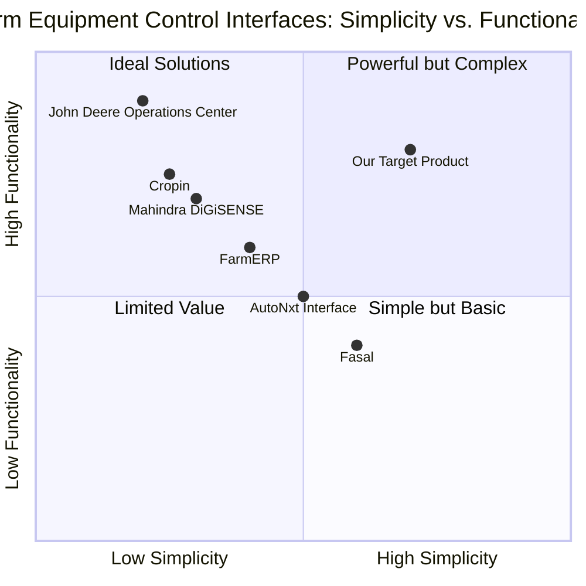

# Product Requirements Document (PRD): Sevak Mini Tractor Web Control Interface

## 1. Language & Project Info

- **Language**: English
- **Programming Language**: React, JavaScript, Tailwind CSS
- **Project Name**: sevak_control_interface

### Original Requirements
Create a web-based control interface prototype for the 'Sevak' mini tractor - an electric, autonomous mini tractor designed for rural areas in India that can cut fodder, load it into an attached trailer, and transport it to livestock areas. The web interface should include features for monitoring and controlling the tractor, scheduling autonomous operations, manual override controls, battery status display, operational metrics, and responsive design for mobile devices.

## 2. Product Definition

### 2.1 Product Goals
1. Provide an intuitive and accessible web-based interface for rural Indian farmers to remotely control and monitor the Sevak mini tractor operations
2. Enable efficient scheduling and management of autonomous fodder harvesting and transportation tasks
3. Increase farming productivity by optimizing tractor operations while accommodating the technical constraints and user capabilities in rural Indian contexts

### 2.2 User Stories
1. As a farmer with limited technical knowledge, I want a simple visual interface so that I can easily control the Sevak tractor without extensive training
2. As a livestock owner, I want to schedule recurring fodder harvesting tasks so that I can automate daily feeding operations
3. As a farmer working in multiple fields, I want to monitor the tractor's location and status remotely so that I can manage my time efficiently
4. As a user in an area with intermittent connectivity, I want offline functionality so that I can continue basic operations when internet connection is unstable
5. As a tractor owner, I want to view operational metrics and battery status so that I can optimize usage and plan charging cycles

### 2.3 Competitive Analysis

#### Mahindra DiGiSENSE
**Pros:**
- Comprehensive telematics solution for agricultural equipment
- Strong brand recognition in Indian market
- Integration with multiple vehicle types

**Cons:**
- Complex interface with steep learning curve
- Primarily focused on monitoring rather than control
- Requires consistent internet connectivity

#### John Deere Operations Center
**Pros:**
- Advanced farm management capabilities
- Robust data analytics
- Well-established global support system

**Cons:**
- Expensive ecosystem
- Overly complex for small farm operations
- Not specifically designed for Indian rural contexts

#### FarmERP
**Pros:**
- Comprehensive farm management software
- Indian company with local market understanding
- Multiple language support

**Cons:**
- Primarily focused on crop management, not machinery control
- Requires significant digital literacy
- Higher subscription costs

#### Cropin
**Pros:**
- AI-powered insights
- Cloud-based solution accessible anywhere
- Designed for emerging markets

**Cons:**
- More focused on data analytics than equipment control
- Requires smartphone proficiency
- Complex dashboard interface

#### Fasal
**Pros:**
- Simplified interface for Indian farmers
- Focus on local crop varieties and conditions
- IoT integration capabilities

**Cons:**
- Limited machinery control features
- Primarily focuses on crop monitoring and weather
- Requires hardware installations

#### AutoNxt Automation Interface
**Pros:**
- Specifically designed for autonomous tractors in India
- Includes battery management features
- Offers basic autonomous control

**Cons:**
- Limited market presence
- Early-stage technology with reliability concerns
- Minimal offline functionality

### 2.4 Competitive Quadrant Chart

## 3. Technical Specifications

### 3.1 Requirements Analysis
The Sevak mini tractor control interface must address several key technical challenges:

1. **Connectivity Constraints**: Rural India faces significant internet connectivity challenges with inconsistent coverage and bandwidth limitations. The interface must function effectively in low-connectivity environments.

2. **User Accessibility**: The interface must accommodate varying levels of digital literacy and education among rural farmers, prioritizing visual communication and simplified interactions.

3. **Device Compatibility**: Many rural users may access the interface through older smartphones or shared devices, requiring optimization for a wide range of screen sizes and processing capabilities.

4. **Safety Controls**: Remote operation of agricultural machinery presents safety risks that must be mitigated through fail-safe mechanisms, emergency stops, and clear status indicators.

5. **Security Requirements**: The system must implement appropriate security measures to prevent unauthorized access while remaining accessible to legitimate users with limited technical knowledge.

6. **Operational Efficiency**: The interface must allow for efficient scheduling and management of autonomous operations to maximize battery life and tractor productivity.

### 3.2 Requirements Pool

#### P0 (Must-have)
1. Dashboard with real-time tractor status visualization (location, operation mode, battery level)
2. Manual control interface with intuitive directional controls and operation toggles (cutting, loading, transporting)
3. Emergency stop functionality prominently displayed on all screens
4. Basic scheduling functionality for automated tasks
5. Offline mode for core control functions when connectivity is lost
6. Mobile-responsive design that works on diverse screen sizes
7. Visual-first interface with minimal text requirements
8. Battery status monitoring with alerts for low charge
9. Authentication system with secure but accessible login methods
10. Local language support (Hindi and at least 2 regional languages)

#### P1 (Should-have)
1. Map visualization of tractor location and planned paths
2. Task history and completion records
3. Voice command capability for key operations
4. Usage analytics and operational efficiency metrics
5. Maintenance alerts and scheduling
6. Multiple user accounts with role-based permissions
7. Weather integration to recommend optimal operation times
8. Quick-access preset routes and common tasks
9. Video feed from tractor-mounted camera when connectivity allows
10. Customizable dashboard layout

#### P2 (Nice-to-have)
1. Integration with farm management systems
2. Predictive maintenance notifications based on usage patterns
3. Community features to share routes and best practices
4. Advanced autonomous path planning with obstacle avoidance settings
5. Integration with local market rates for fodder to calculate ROI
6. Power optimization recommendations based on usage patterns
7. Multi-tractor fleet management capabilities
8. Augmented reality visualization for maintenance guidance
9. Smart scheduling based on historical patterns and weather forecasts
10. Gamification elements to encourage efficient operation

### 3.3 UI Design Draft

The Sevak control interface will prioritize visual clarity with large touch targets and minimal text. The primary layout includes:

#### Dashboard Screen
- Large status indicators with color coding (green: operational, yellow: standby, red: issue)
- Circular battery indicator with percentage and estimated runtime remaining
- Current operation icon (cutting, loading, transporting) with animation to show activity
- Large quick-action buttons for common tasks
- Map showing current location with simple field boundary visualization
- Weather summary with operation recommendations

#### Control Screen
- Large directional pad for manual movement control
- Slider for speed adjustment with turtle/rabbit icons for slow/fast
- Toggle buttons with visual icons for operation modes
- Emergency stop button (red) fixed at bottom of screen, always visible
- Status feedback area showing tractor response to commands
- Visual indicators of active components (cutter, loader, transport mechanisms)

#### Schedule Screen
- Calendar view with visual task indicators
- Simple task creation through icon selection and time setting
- Recurring task setup with visual frequency selector
- Drag-and-drop task rearrangement
- Visual confirmation of scheduled vs. completed tasks

#### Settings Screen
- Language selection with flag icons
- Profile management with minimal text entry
- Connectivity options with visual signal strength indicators
- Notification preferences with simple toggles
- Help section with video tutorials rather than text instructions

### 3.4 Open Questions

1. **Connectivity Requirements**: What is the minimum connectivity needed for critical operations? Should certain functions be completely unavailable offline for safety reasons?

2. **Authentication Balance**: How do we balance security requirements with ease of access for users with limited digital literacy?

3. **Emergency Protocols**: What fail-safe mechanisms should be implemented if connection is lost during critical operations?

4. **Field Mapping**: How will initial field boundaries be established? Will this require technical assistance or can it be user-driven?

5. **Multi-user Access**: How will the system handle multiple users potentially trying to control the same tractor?

6. **Training Approach**: What onboarding and training methods will best support users with varying levels of technical proficiency?

7. **Battery Management**: Should the system include automated return-to-charge functionality when battery reaches critical levels?

8. **Local Storage**: How much data should be stored locally on user devices to support offline functionality?

9. **Update Mechanism**: How will software updates be delivered and installed in areas with limited connectivity?

10. **Safety Certifications**: What safety certifications or standards should the control interface meet for agricultural automation in India?